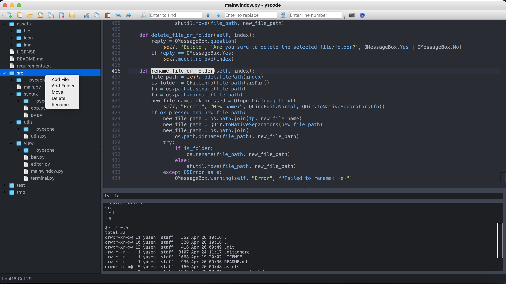

YSCODE
=====
A tiny Code Editor



Env
-----
```bash
# Use conda to create a virtual environment
$ conda create -n <env> --file requirements.txt
$ conda activate <env>
# or use pip
$ pip install PyQt5 
```

Run
-----
```bash
$ python3 ./src/main.py
```

TODO
-----
- [x] UI
- [x] Line Numbers
- [x] Highlight Current Line
- [x] File open/save/edit
- [x] Toolbar
- [x] Find and Replace
- [ ] Syntax Highlighting
- [ ] Add Terminal
- [x] File Tree
- [x] Right Click Menu
- [x] Auto Indentation
- [x] Scrollbar
- [x] Font Size
- [x] Toggle Sidebar

References
-----
- [Build Your Own Text Editor](https://viewsourcecode.org/snaptoken/kilo/)
- [Fugue icon set](https://p.yusukekamiyamane.com/)
- [Python Editor (created with PyQt5)](https://gist.github.com/Axel-Erfurt/8c84b5e70a1faf894879cd2ab99118c2)
- [PyQt5 Toolbars & Menus — QAction](https://www.pythonguis.com/tutorials/pyqt-actions-toolbars-menus/)